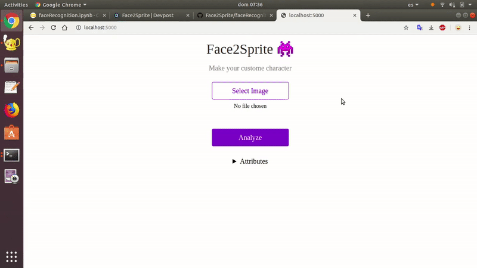

# Face2Sprite
Have you ever thought about being the main character of your game With our app, you can take yourself a photo and have a 8 bit character in only a few seconds with your facial attributes.

## Exemples

### Demo

## How
Dataset [CelebFaces Attributes (CelebA) Dataset](https://www.kaggle.com/jessicali9530/celeba-dataset) from Kaggle.

With [fastai](https://www.fast.ai) library.

Prepared to run on [Render](https://render.com).

You can find the source of the face-recognition modle [src/faceRecognition](src/faceRecognition.ipynb), all the code can be run it on Google Colab (you need to upload a kaggle.json API toke from your own account).

## Run the app server locally
First of all, you have to see all the [Requirements](./requirements.txt), then run this command in your terminal:

    python3 app/server.py serve

And open the following url 'http://localhost:5000/'. PD: only tested in Linux

## Authors
Alejandre Campos, German 
Danci, Marian Dumitru 
Gómez Virgili, Miquel 
